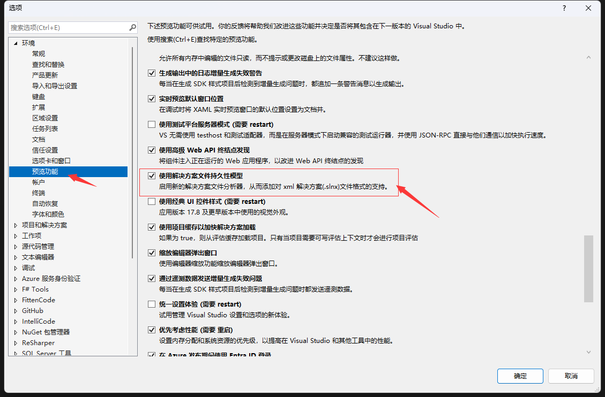

## VS 新版解决方案件

> 前几天.NET9 Preview3 更新了,同时更新了 VS 以及一些工具和 Nuget 包.

今天我们讨论的内容则是 VS2022 17.10.0 Preview 3.0 带来的新的解决方案文件.

旧的解决方案文件的后缀为 **.sln** 这里我用我们的 EasilyNET 项目的来做个例子.

```csharp
Microsoft Visual Studio Solution File, Format Version 12.00
# Visual Studio Version 17
VisualStudioVersion = 17.10.34804.81
MinimumVisualStudioVersion = 10.0.40219.1
Project("{2150E333-8FDC-42A3-9474-1A3956D46DE8}") = "test", "test", "{0C88DD14-F956-CE84-757C-A364CCF449FC}"
EndProject
Project("{2150E333-8FDC-42A3-9474-1A3956D46DE8}") = "Mongo", "Mongo", "{537BF619-5E2D-4799-D114-C1B6F4B470C9}"
EndProject
Project("{2150E333-8FDC-42A3-9474-1A3956D46DE8}") = "Framework", "Framework", "{E0AD1809-C64F-3D39-45E0-E424261CE16D}"
EndProject
Project("{2150E333-8FDC-42A3-9474-1A3956D46DE8}") = "Core", "Core", "{8D626EA8-CB54-BC41-363A-217881BEBA6E}"
EndProject
Project("{2150E333-8FDC-42A3-9474-1A3956D46DE8}") = "src", "src", "{827E0CD3-B72D-47B6-A68D-7590B98EB39B}"
	ProjectSection(SolutionItems) = preProject
		src\Directory.Packages.props = src\Directory.Packages.props
	EndProjectSection
EndProject
Project("{2150E333-8FDC-42A3-9474-1A3956D46DE8}") = "Solution Items", "Solution Items", "{089100B1-113F-4E66-888A-E83F3999EAFD}"
	ProjectSection(SolutionItems) = preProject
		Build.ps1 = Build.ps1
		Directory.Build.props = Directory.Build.props
		EasilyNET.snk = EasilyNET.snk
		gitemoji.md = gitemoji.md
		LICENSE = LICENSE
		Push.ps1 = Push.ps1
		README.md = README.md
		ToUTF8.ps1 = ToUTF8.ps1
	EndProjectSection
EndProject
Global
	GlobalSection(SolutionConfigurationPlatforms) = preSolution
		Debug|Any CPU = Debug|Any CPU
		Release|Any CPU = Release|Any CPU
	EndGlobalSection
	GlobalSection(ProjectConfigurationPlatforms) = postSolution
		{0946F8C0-D42D-D461-E119-5C393FC1F932}.Debug|Any CPU.ActiveCfg = Debug|Any CPU
		{0946F8C0-D42D-D461-E119-5C393FC1F932}.Debug|Any CPU.Build.0 = Debug|Any CPU
		{0946F8C0-D42D-D461-E119-5C393FC1F932}.Release|Any CPU.ActiveCfg = Release|Any CPU
		{0946F8C0-D42D-D461-E119-5C393FC1F932}.Release|Any CPU.Build.0 = Release|Any CPU
		{F71CC94F-31EF-2277-8F41-D2191F2C6430}.Debug|Any CPU.ActiveCfg = Debug|Any CPU
		{F71CC94F-31EF-2277-8F41-D2191F2C6430}.Debug|Any CPU.Build.0 = Debug|Any CPU
		{F71CC94F-31EF-2277-8F41-D2191F2C6430}.Release|Any CPU.ActiveCfg = Release|Any CPU
		{F71CC94F-31EF-2277-8F41-D2191F2C6430}.Release|Any CPU.Build.0 = Release|Any CPU
		{0AB1B745-ABBF-7640-30F7-8FC177720326}.Debug|Any CPU.ActiveCfg = Debug|Any CPU
		{0AB1B745-ABBF-7640-30F7-8FC177720326}.Debug|Any CPU.Build.0 = Debug|Any CPU
		{0AB1B745-ABBF-7640-30F7-8FC177720326}.Release|Any CPU.ActiveCfg = Release|Any CPU
		{0AB1B745-ABBF-7640-30F7-8FC177720326}.Release|Any CPU.Build.0 = Release|Any CPU
	EndGlobalSection
	GlobalSection(SolutionProperties) = preSolution
		HideSolutionNode = FALSE
	EndGlobalSection
	GlobalSection(NestedProjects) = preSolution
		{537BF619-5E2D-4799-D114-C1B6F4B470C9} = {827E0CD3-B72D-47B6-A68D-7590B98EB39B}
		{E0AD1809-C64F-3D39-45E0-E424261CE16D} = {827E0CD3-B72D-47B6-A68D-7590B98EB39B}
		{8D626EA8-CB54-BC41-363A-217881BEBA6E} = {827E0CD3-B72D-47B6-A68D-7590B98EB39B}
		{0946F8C0-D42D-D461-E119-5C393FC1F932} = {0C88DD14-F956-CE84-757C-A364CCF449FC}
		{F71CC94F-31EF-2277-8F41-D2191F2C6430} = {537BF619-5E2D-4799-D114-C1B6F4B470C9}
		{0AB1B745-ABBF-7640-30F7-8FC177720326} = {537BF619-5E2D-4799-D114-C1B6F4B470C9}
		{2381296E-23AF-7883-EC5D-837E2279245A} = {537BF619-5E2D-4799-D114-C1B6F4B470C9}
	EndGlobalSection
EndGlobal

```

上面的内容我为了减少篇幅,随意的删减了一些.即使是这样,可以看到,上面很多 GUID 形式的各种 ID 若是我们希望进行调整一些东西,是相当的不方便,并且不够直观.这个格式的文件已经用了很多年了.然而微软最近在这个方面做出了改进,引入了一个新的格式 **.slnx** 接下来我们先看看文件的内容.

```xml
<Solution>
  <Folder Name="/test/">
    <Project Path="test\EasilyNET.Test.Unit\EasilyNET.Test.Unit.csproj" />
  </Folder>
  <Folder Name="/src/Mongo/">
    <Project Path="src\EasilyNET.Mongo.AspNetCore\EasilyNET.Mongo.AspNetCore.csproj" />
    <Project Path="src\EasilyNET.Mongo.ConsoleDebug\EasilyNET.Mongo.ConsoleDebug.csproj" />
    <Project Path="src\EasilyNET.Mongo.Core\EasilyNET.Mongo.Core.csproj" />
    <Project Path="src\EasilyNET.MongoDistributedLock.AspNetCore\EasilyNET.MongoDistributedLock.AspNetCore.csproj" />
    <Project Path="src\EasilyNET.MongoDistributedLock\EasilyNET.MongoDistributedLock.csproj" />
    <Project Path="src\EasilyNET.MongoGridFS.AspNetCore\EasilyNET.MongoGridFS.AspNetCore.csproj" />
    <Project Path="src\EasilyNET.MongoSerializer.AspNetCore\EasilyNET.MongoSerializer.AspNetCore.csproj" />
  </Folder>
  <Folder Name="/src/Framework/">
    <Project Path="src\EasilyNET.AutoDependencyInjection.Core\EasilyNET.AutoDependencyInjection.Core.csproj" />
    <Project Path="src\EasilyNET.AutoDependencyInjection\EasilyNET.AutoDependencyInjection.csproj" />
    <Project Path="src\EasilyNET.Images\EasilyNET.Images.csproj" />
    <Project Path="src\EasilyNET.RabbitBus.AspNetCore\EasilyNET.RabbitBus.AspNetCore.csproj" />
    <Project Path="src\EasilyNET.RabbitBus.Core\EasilyNET.RabbitBus.Core.csproj" />
    <Project Path="src\EasilyNET.Security\EasilyNET.Security.csproj" />
  </Folder>
  <Folder Name="/src/Core/">
    <Project Path="src\EasilyNET.Core\EasilyNET.Core.csproj" />
    <Project Path="src\EasilyNET.WebCore.Swagger\EasilyNET.WebCore.Swagger.csproj" />
    <Project Path="src\EasilyNET.WebCore\EasilyNET.WebCore.csproj" />
  </Folder>
  <Folder Name="/src/">
    <File Path="src\Directory.Packages.props" />
  </Folder>
  <Folder Name="/Solution Items/">
    <File Path="Build.ps1" />
    <File Path="Directory.Build.props" />
    <File Path="EasilyNET.snk" />
    <File Path="gitemoji.md" />
    <File Path="LICENSE" />
    <File Path="Push.ps1" />
    <File Path="README.md" />
    <File Path="ToUTF8.ps1" />
  </Folder>
  <Folder Name="/sample/">
    <Project Path="sample\WebApi.Test.Unit\WebApi.Test.Unit.csproj" />
  </Folder>
</Solution>
```

可以通过格式看出来,这个是一个 XML 格式的文件,里面的内容简单清晰,直观.若是需要修改也很简单.并且文本内容也缩短了不少.接下来讲解一下如何将旧的解决方案文件保存为新的格式.

由于该功能还是预览功能,所以要先去 VS 的设置中开启预览功能.



接下来我们回到主界面,使用鼠标将选中项选中我们的解决方案,再点击文件另存为 **.slnx** 格式.


接下来我们便可以通过新的解决方案文件进行项目管理.不过目前还存在一些问题,比如 Rider 和 Reshaper 可能还无法识别新的格式,所以我们还是需要保留旧的 **.sln** .同样在 GitHub Actions 里面也还无法识别,需要等待后面的更新,不过我们可以看到一切都在向更好的方向发展.
